# 0 AD - 2000 AD

<!-- nopb -->

#### Mosaic floor in Pompeii

Mosaic floor<!-- cite author="Karl" title="House of Tragic Poet as House of Glaucus - Pompeii - Mosaic floor" date="" location="" type="website" href="https://www.flickr.com/photos/70125105@N06/13980198177/" --> in the House of Tragic Poet as House of Glaucus. Italy, Pompeii. Undated.

<!-- endnopb -->
<!-- nopb -->

#### Broken floor mosaic

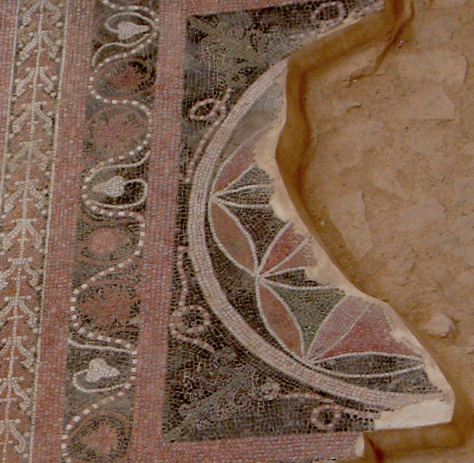{caption=1 width=600}

Broken floor mosaic of pomegranates, fig leaves and geometrical pattern of circles (the FOL) on the reception room in the Western Palace built by Herod the Great. Masada, Israel, 30 BC – 70 AD. (© James Emery)

<!-- endnopb -->
<!-- nopb -->

#### Mosaic floor in Seville

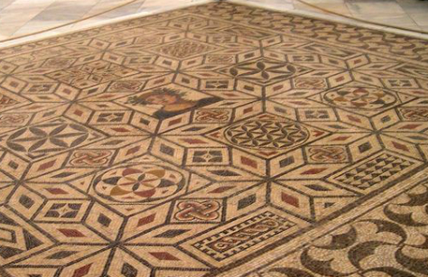{caption=1 width=600}

Possibly a Roman period mosaic floor in the Archaeological Museum of Seville, Spain. Undated. (Photo © Rafael del Pino)

<!-- endnopb -->
<!-- nopb -->

#### Roman temple stele

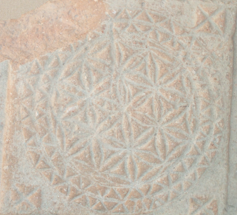{caption=1 width=600}

A stele from the Roman temple ruins. Córdoba, Spain, 100 - 500 AD. (© Steve Pope)

<!-- endnopb -->
<!-- nopb -->

#### Floor mosaic in Besancon

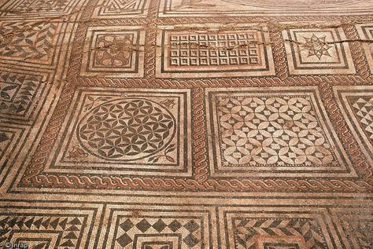{caption=1 width=600}

Geometrical motifs in the mosaics visible in the Museum of Fine Arts and Archaeology. Besancon, France, Gallo-Roman Period 123 BC – 486 AD. (© Pierre Dupont, Inrap)

<!-- endnopb -->
<!-- nopb -->

#### Floor mosaic

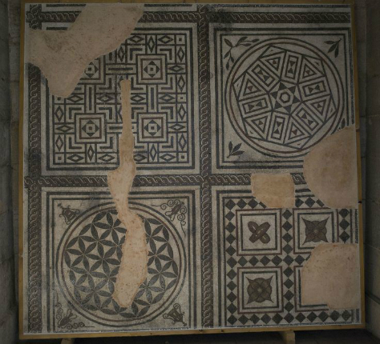{caption=1 width=600}

Geometrical motifs in the mosaics visible in the Museum of Fine Arts and Archaeology. Besancon, France, Gallo-Roman Period 123 BC – 486 AD. (© heroesbed)

<!-- endnopb -->
<!-- nopb -->

#### Basilica floor mosaic

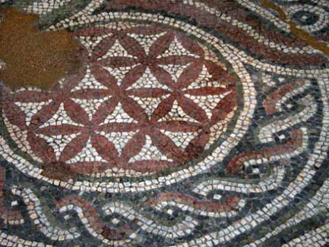{caption=1 width=600}

A mosaic floor from the basilica in the town near to Yambol. Kabile, Bulgaria, 400 AD. (Photo © bulstack.com)

<!-- endnopb -->
<!-- nopb -->

#### Sassanian bowl

A Sassanian inscribed parcel-gilt [silver bowl](http://www.christies.com/lotfinder/LargeImage.aspx?image=http://www.christies.com/lotfinderimages/d48895/d4889595x.jpg). 400 – 500 AD.

<!-- endnopb -->
<!-- nopb -->

#### Wall in Syria

About 100 kilometers west of Deir az-Zor on the Euphrates river in the Syrian desert is the Ummayad hunting château where wall paintings<!-- cite author="Hans-Christian" title="Picture of temple ruins in Qasr al-Hair ash-Sharqi" date="" location="" type="website" href="https://www.flickr.com/photos/7283893@N05/5230474741/in/faves-48694711@N03/" --> resembles much like drawings of the Leonardo da Vinci. Qasr al-Hair ash-Sharqi, 729 AD.

<!-- endnopb -->
<!-- nopb -->

#### Pavement

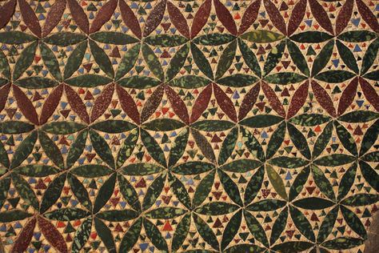{caption=1}

A multicolor opaque glass _Cosmati_ pavement in the Westminster Abbey<!-- cite author="westminster-abbey.org" title="Westminster Abbey conservation" date="" location="" type="website" href="http://www.westminster-abbey.org/conservation" --> Gothic church. London, England, 1268 AD. (Photo © Dean and Chapter of Westminster)

<!-- endnopb -->
<!-- nopb -->

#### Byzantine ruins

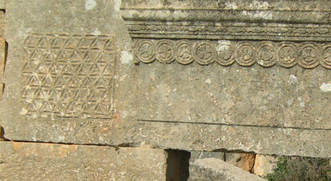{caption=1}

Byzantine era ruins from Deir Seta, Syria, around 1400 AD. (Photo © Abd)

<!-- endnopb -->
<!-- nopb -->

#### Hampi temple pillar

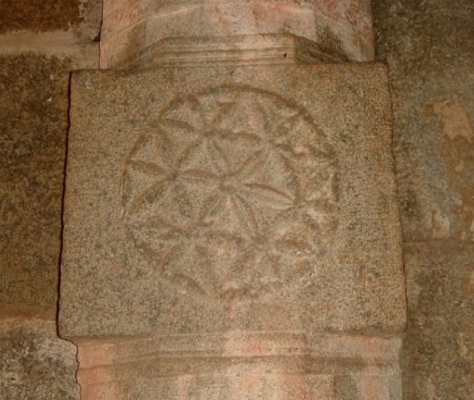{caption=1 width=600}

The Flower of Life symbol in the pillar in the Hampi temple<!-- cite author="wikipedia.org" title="Hampi temple" date="" location="" type="website" href="https://en.wikipedia.org/wiki/Hampi" -->. India, 1400 AD. (Photo © Wm Jas)

<!-- endnopb -->
<!-- nopb -->

#### Cemetery decorations

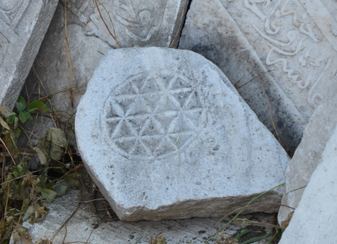{caption=1 width=600}

Ottoman cemetery headstone decorations from the antique field of ancient Smyrna. Izmir, Turkey, 1400 AD. (Photo © Marko Manninen / Creative Commons)

<!-- endnopb -->
<!-- nopb -->

#### Sarcophagus

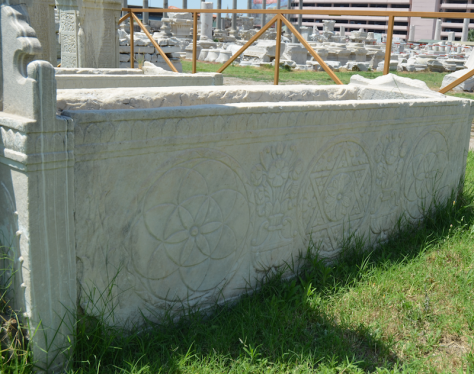{caption=1}

An Ottoman sarcophagus in the antique field of ancient Smyrna. Izmir, Turkey, 1400 AD. (Photo © Marko Manninen / Creative Commons)

<!-- endnopb -->
<!-- nopb -->

#### Castle of Rozmberk

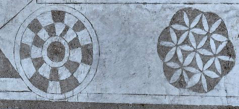{caption=1}

Flower of Life and other geometric symbols from the castle of Rozmberk<!-- cite author="wikipedia.org" title="Castle of Rozmberk" date="" location="" type="website" href="https://en.wikipedia.org/wiki/Rožmberk_Castle" --> in the Czech Republic. On 14 - 16th century AD castle was owned by a Czech alchemist, symbols orinating probably from that period. (Photo © Mark Libal)

<!-- endnopb -->
<!-- nopb -->

#### Leonardo da Vinci's notes

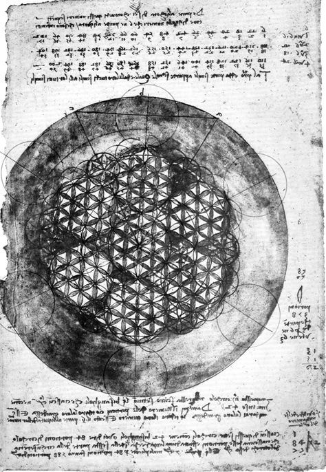{caption=1 width=600}

Leonardo da Vinci's explorations of the hexagonal geometry on his Codex Atlanticus<!-- cite author="wikipedia.org" title="Codex Atlanticus" date="" location="" type="website" href="https://en.wikipedia.org/wiki/Codex_Atlanticus" --> notebooks, folio 307 verso<!-- cite author="wikimedia.org" title="Codex Atlanticus, folio 307 verso" date="" location="" type="website" href="https://commons.wikimedia.org/wiki/File:Leonardo_da_Vinci_%E2%80%93_Codex_Atlanticus_folio_307v.jpg" -->. Italy, 1500 AD. (Public Domain)

<!-- endnopb -->
<!-- nopb -->

#### Stone inscriptions

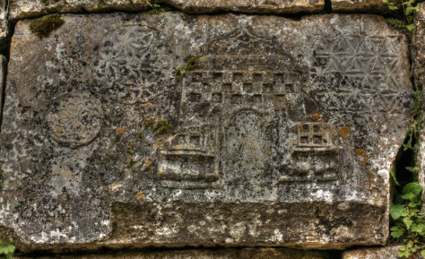{caption=1 width=600}

Inscription on the stones of the surrounding wall of Demir Baba Teke, Alevi mausoleum near the village of Sveshtari, in northeastern Bulgaria, 1600 AD. (Photo © Klearchos Kapoutsis)

<!-- endnopb -->


