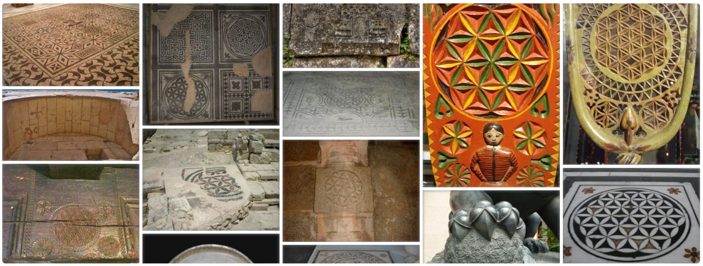

# 1500 AD and still going strong

Much later geometrical patterns were used in the Arabic culture as an art itself. This is due to the fact that in their tradition God, prophets or even people and animals were not allowed to be drawn. For example, Ottomans used the FOL on cemetery works (pic. [6.2.10](0-2000ad.md#fig6.2.10)), sarcophagus (pic. [6.2.11](0-2000ad.md#fig6.2.11)), tombs and Seljuk caravanserai gates. Orthodox Christians in Patmos island applied *sacred geometry* above the chapel door lunette (pic. [6.3.3](undated.md#fig6.3.3), [6.3.4](undated.md#fig6.3.4)), thus appreciating the symbology behind the intersecting circles. You can see more complex figure on the lunette only when zooming in to the image, which just adds tickling enigma around the symbol.

Multicolor opaque glass pavement (pic. [6.2.7](0-2000ad.md#fig6.2.7)) in the Westminster Abbey Gothic church incorporates the FOL symbol. It is well known that Vesica Piscis<!-- cite author="wikipedia.org" title="Vesica Piscis" date="" location="" type="website" href="http://en.wikipedia.org/wiki/Vesica_piscis" --> is the basis of the FOL geometry and used widely on iconography though in the Orthodox tradition. By Orthodox symbolism Vesica Piscis is rather called a mandorla<!-- cite author="orthodoxwiki.org" title="Mandorla" date="" location="" type="website" href="http://orthodoxwiki.org/Mandorla" --> (almond) or a nimbus, which refers to the halo around the Saint. The FOL tradition possibly goes to the beginning of the Christian church. But surely tradition of the FOL can be traced much further to the history.

At this point it is good to lift up once more the specialty of the FOL symbol and at the same time its undiscovered history. S. Limani in his *An Eleventh Century Shipwreck Vol. 1* book<!-- cite author="S. Limani" title="An Eleventh Century Shipwreck Vol. 1" date="" location="page 405" type="book" href="https://books.google.fi/books/about/Ser%C3%A7e_Limani.html?id=E6ZJ-05aC-sC" --> lists several lead net sinkers that has the six petal rosette symbol on them. He writes:

> ...regardless of its purpose, the rosette, rare among the Jewish remains of Greece and Rome, is a particularly eastern Jewish phenomenon... rosettes, used as ornament details on fifth and sixth century churches, were a particularly eastern Christian phenomenon as well, being peculiar to northern Syria.

The formation of the FOL is simple, as noted before. E.R. Goodenough, the author of the monumental thirteen volume work about the Jewish and Christian symbolism<!-- cite author="E.R. Goodenough" title="Jewish Symbols in the Greco Roman, Vol. 5 & 7" date="1958" location="" type="book" href="#" -->, calls the six petal rosette

> the most banal of all designs

as quoted by Limani. Neither Goodenough or Limani knows hardly anything about the FOL in its full pattern. Nor do they know six petal rosette form from much older history.

If I would really need to guess the origin of the geographical area, where the FOL was first used in its fullest magnitude, my bet would be on upper Mesopotamia. So rich is the tradition of using geometrical forms, especially usage of the six petal rosette. Tradition there has lasted long and rich.

Finally, my historic survey ends at around 1500 AD, when Leonardo da Vinci used several pages on his sketchbook (pic. [6.2.13](0-2000ad.md#fig6.2.13)) to investigate the properties of the hexagonal net/grid when he studied the theory of lunes<!-- cite author="Stephen Wolfram" title="Wolfram Science" date="2002" location="page 872, note d" type="book" href="https://www.wolframscience.com/nksonline/page-872d-text" -->. He was interested in the proportions of such a grid because it can be found from nature. For example in bumble bee cells, turtle's carapace and snowflakes. The theory of lunes, ie. geometric figures formed by the intersection of two circular arcs, was invented by the Greek mathematician Hippocrates of Chios in 440 BC<!-- cite author="Frank J. Swetz" title="From Five Fingers to Infinity: A Journey Through the History of Mathematics" date="1994" location="" type="book" href="#" -->. Both Leonardo and Hippocrates were investigating lunes to unveil the ancient "squaring the circle" enigma.

{caption=1}


