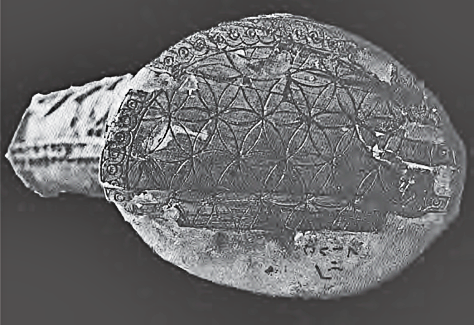
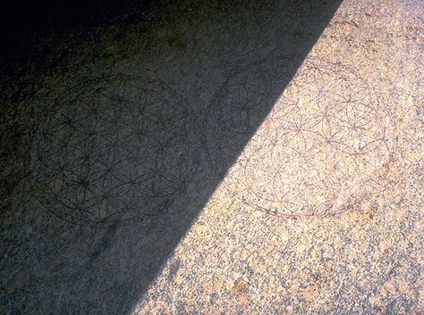

# 2000 BC - 0 AD

<!-- nopb -->

#### Golden rosettes

Golden six petal rosettes in the archaeological museum of Istanbul. Mycenae, Greece, 1600 BC. (Photo © Marko Manninen / Creative Commons)

<!-- endnopb -->
<!-- nopb -->

#### Cosmetic box

A circular wooden cosmetic box with a swivel lid in the The Metropolitan Museum of Art in New York. Thebes, Egypt, 1492-1473 BC. Note resembling 12 petal rosette in the ivory box 1550 BC and 32 ray straight line star from the same period. (Photo © MET)

<!-- endnopb -->
<!-- nopb -->

#### Silver goblet

A silver goblet in the museum of Louvre. Underside of the object was unreachable for the visitors because the goblet stands on thick basement. But picture in the object description shows a full Flower of Life pattern in the bottom, very much similar to the silver goblet underside decoration in Stockholm. Unfortunately only very little is known about the Marlik culture, but artifacts found from the royal cemetery shows excellence in the gold and silver metalwork. Marlik, northern Iran, 1400–1100 BC. (Photo © Marko Manninen / Creative Commons)

<!-- endnopb -->
<!-- nopb -->

#### Golden goblet

Underside of a golden goblet in the museum of Louvre. Excavation report shows several artifacts having similar six-petal rosettes with surrounding petals under the goblets and beakers. Marlik, Iran, 1400–1100 BC. (Photo © 1985 Photo RMN / Pierre et Maurice Chuzeville)

<!-- endnopb -->
<!-- nopb -->

#### Ivory whorl

This artifact was categorized as a local objects from the sanctuary of Aphrodite. It is visible in the Museum of Palaipafos (Kouklia, Cyprus). Dating is mentioned between 1600-1100BC making it one of the oldest FOL found from the mediterranean world.

Similar [ivory whorls](http://www.britishmuseum.org/research/collection_online/collection_object_details/collection_image_gallery.aspx?assetId=94799&objectId=452251&partId=1) can be seen in the British Museum. They are also from Cyprus, 1340-1050 BC. Note how peripheral petals are roughly made probably by a hand. This is a good example how precise much work it takes to draw the whole FOL pattern after the first seven simple circles.

<!-- endnopb -->
<!-- nopb -->

#### Phoenician bowl

A [phoenician bowl](http://collections.lacma.org/node/226166) in the Los Angeles County Museum of Art. 850 BC.

<!-- endnopb -->
<!-- nopb -->

#### Idalion cup

A cup with [mythological scenes](https://commons.wikimedia.org/wiki/File:Cup_Idalion_Louvre_N3454.jpg) and flower of life pattern in the in its center visible in the Louvre museum. Idalion, Cyprus, 800–700 BC. (Photo © Public Domain)

<!-- endnopb -->
<!-- nopb -->

#### Oval pyxis

An oval pyxis with a base and a lid in the Iraq Museum, Baghdad. Nimrud, 800–700 BC. Note the object IM79513 that has similar, but badly cracked lid with the same geometric figure. (Photo © G. Herrmann & S. Laidlaw: Ivories from Nimrud VI)

<!-- endnopb -->
<!-- nopb -->

#### Terracotta torso

A cypriot terracotta torso in the British Museum. Similar terracotta torsos with the FOL pattern are visible on the Archaeological Museum of Lefkosia also. Salamis, Greece, around 700 BC. (Photo © B.B. Shefton: Greek vases)

<!-- endnopb -->
<!-- nopb -->

#### Ivory tusk

A carved ivory tusk in the Iraq Museum, Baghdad. Nimrud, 800-700 BC. (Photo © G. Herrmann & S. Laidlaw: Ivories from Nimrud VI)

<!-- endnopb -->
<!-- nopb -->

#### Ivory plague

A fragment of an ivory plaque in the Iraq Museum, Baghdad. Nimrud, 800-700 BC. (Photo © G. Herrmann & S. Laidlaw: Ivories from Nimrud VI)

<!-- endnopb -->
<!-- nopb -->

#### Bronze vessel

A bronze vessel from the palace of Sennacherib. New York public library. Iraq, Nimrud, 700 BC. (Photo © NYPL Digital Library)

<!-- endnopb -->
<!-- nopb -->

#### Stone floor sill

A stone floor sill with a field of interlocking circles decoration from the palace of King Ashurbanipal. Visible in the Museum of Louvre. Related objects are also visible in the British Museum (BM 118910, BM 118913). The northern Iraq, 645 BC. (Photo © Marko Manninen / Creative Commons)

<!-- endnopb -->
<!-- nopb -->

#### Silver beaker

An ancient Near East silver beaker bottom motif, 600–500 BC. Object is in the Swedish Medelhavsmuseet. Kind staff from the museum gave me this information:

> The archived accession catalogue gives that it was received in 1980, probably through a certain O. Engkvist. There is also a comment in the margin: Prob Archaemenid, acc. To Vincent Pigott (Iran in the Near East), Prof pennsylvania, USA. Personal communication.

(Photo © Ove Kaneberg)

<!-- endnopb -->
<!-- nopb -->

#### Ornament at the Temple of Osiris

An ornament found at the stone slab in the Temple of Osiris. Claimed to have origins from 3000 BC (or even much older), but critical analysis gives dates from 400-200 BC to even after 1900 AD. Abydos, Egypt. (Photo © Ray Flowers)

<!-- endnopb -->
<!-- nopb -->

#### Cave arches

Chaitya arches in form of wood lattice patterns, floral patterns, berm-rail arches and a parapet with Assyrian pattern of a row of stepped triangles in the Buddhist temple of Pitalkhora. Maharashtra, India, 200–100 BC. (Photo © Vivek S. Kale)

<!-- endnopb -->
<!-- nopb -->

#### Opus signinum

Opus signinum (mosaic floor) of the Roman period house in the “city of charity”, Caminreal. Spain, 200-100 BC. (Photo © Jalme D.V. Redon)

<!-- endnopb -->
<!-- nopb -->

#### Floor mosaic at Ephesus

Floor mosaic that lays on the house 1a on the Curetes Street, near the Library of Celsus in the archaeological site of Ephesus, Turkey, 100 BC. (Photo © Ken & Nyetta)

<!-- endnopb -->
<!-- nopb -->

#### Floor mosaic in Cyprus

Mosaic floor ornament of late Hellenistic period at Roman agora, the archaeological site of Kourion in Cyprus. 75–50 BC. (Photo © Andrew Sweeney)

<!-- endnopb -->
<!-- nopb -->

#### Floor mosaic at Herodium

Floor mosaic in the bathhouse at Lower Herodium built by Herod the Great, unearthed and visible at the National Museum of Israel. Israel, 20 BC. (Photo © Shmuel Browns, used with permission)

<!-- endnopb -->
