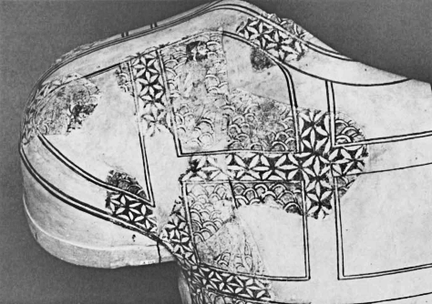

# 2000 BC - 0 AD

<!-- nopb -->

#### Gold foils

{caption=1}

Mycenaean funerary gold foil attachments with six petal rosette geometry found from the Archaeological Museum of Istanbul. Mycenae, Greece, 1600 BC. (Photo © Marko Manninen / Creative Commons)

<!-- endnopb -->
<!-- nopb -->

#### Cosmetic box

{caption=1}

A circular wooden cosmetic box with a swivel lid<!-- cite author="metmuseum.org" title="Circular Cosmetic Box with a Swivel Lid" date="" location="" type="website" href="http://www.metmuseum.org/collection/the-collection-online/search/548960?rpp=30&pg=1&ft=lid&when=2000-1000+B.C.&pos=6" --> in the The Metropolitan Museum of Art in New York. Thebes, Egypt, 1492 - 1473 BC. 

> This box has a swivel top incised with a decorative pattern of concentric and overlapping circles that must have been made with an early version of a drawing compass.

Resembling 12 petal rosette in the ivory box<!-- cite author="metmuseum.org" title="Cosmetic Box with a Swivel Top" date="" location="" type="website" href="http://www.metmuseum.org/collection/the-collection-online/search/547031?rpp=20&pg=1&ft=boxes&pos=14" --> 1550 BC and 32 ray straight line star can be found from the same period. (Photo © MET)

<!-- endnopb -->
<!-- nopb -->

#### Silver goblet

{caption=1}

A silver goblet<!-- cite author="louvre.fr" title="Gobelet orné de monstres ailés affrontés" date="" location="" type="website" href="http://cartelen.louvre.fr/cartelen/visite?srv=car_not_frame&idNotice=22115&langue=fr" --> in the museum of Louvre. Underside of the object was unreachable for the visitors because the goblet stands on thick basement. But picture in the object description shows a full Flower of Life pattern in the bottom, very much similar to the silver goblet underside decoration in Stockholm. Unfortunately only very little is known about the Marlik culture<!-- cite author="dooroodiran" title="Marlik Culture" date="" location="" type="website" href="http://dooroodiran.blogspot.fi/2004/04/marlik-culture.html" -->, but artifacts found from the royal cemetery shows excellence in the gold and silver metalwork. Marlik, northern Iran, 1400 – 1100 BC. (Photo © Marko Manninen / Creative Commons)

<!-- endnopb -->
<!-- nopb -->

#### Silver gazelle cup

{caption=1}

Base of the silver gazelle cup. From the Safid River region, Iran, 1000 BC. (Photo © MET)

<!-- endnopb -->
<!-- nopb -->

#### Golden goblet

{caption=1}

Underside of a golden goblet<!-- cite author="louvre.fr" title="Goblet decorated with winged, two-headed monsters, grasping gazelles" date="" location="" type="website" href="http://www.louvre.fr/en/oeuvre-notices/goblet-decorated-winged-two-headed-monsters-grasping-gazelles" --> in the museum of Louvre. Excavation report<!-- cite author="Nigahban, Izzat Allah" title="Marlik: the complete excavation report. v. 2: Illustrations" date="1996" location="" type="book" href="http://digital.library.stonybrook.edu/cdm/ref/collection/amar/id/68056" --> shows several artifacts having similar six-petal rosettes with surrounding petals (or larger rosette nets) under the goblets and beakers. Marlik, Iran, 1400 – 1100 BC. (Photo © 1985 Photo RMN / Pierre et Maurice Chuzeville)

<!-- endnopb -->
<!-- nopb -->

#### Ivory whorl

{caption=1}

This artifact was categorized as a local objects from the sanctuary of Aphrodite. It is visible in the Museum of Palaipafos (Kouklia, Cyprus). Dating is mentioned between 1600 - 1100 BC making it one of the oldest FOL found from the mediterranean world.

Similar ivory whorls<!-- cite author="britishmuseum.org" title="Spindle whorl" date="" location="" type="website" href="http://www.britishmuseum.org/research/collection_online/collection_object_details.aspx?assetId=94799001&objectId=452251&partId=1" --> can be seen in the British Museum. They are also from Cyprus, 1340 - 1050 BC. Note how peripheral petals are roughly made probably by a hand. This is a good example how precise much work it takes to draw the whole FOL pattern after the first seven simple circles.

<!-- endnopb -->
<!-- nopb -->

#### Phoenician bronze bowl

A phoenician bronze bowl<!-- cite author="lacma.org" title="Bronze bowl" date="" location="" type="website" href="http://collections.lacma.org/node/226166" --> in the Los Angeles County Museum of Art. 850 BC.

<!-- endnopb -->
<!-- nopb -->

#### Idalion cup

{caption=1}

A cup with mythological scenes<!-- cite author="wikimedia.org" title="Cup Idalion Louvre" date="" location="" type="website" href="https://commons.wikimedia.org/wiki/File:Cup_Idalion_Louvre_N3454.jpg" --> and flower of life pattern in the in its center visible in the Louvre museum. Idalion, Cyprus, 800 – 700 BC. (Photo © Public Domain)

<!-- endnopb -->
<!-- nopb -->

#### Oval pyxis

{caption=1}

An oval pyxis with a base and a lid in the Iraq Museum, Baghdad. Nimrud, 800 – 700 BC. Note the object IM79513 that has similar, but badly cracked lid with the same geometric figure. (Photo © G. Herrmann & S. Laidlaw<!-- cite author="Georgina Herrmann, Stuart Laidlaw" title="Ivories from Nimrud VI" date="2008" location="" type="book" href="#" -->)

<!-- endnopb -->
<!-- nopb -->

#### Terracotta torso

{caption=1}

A cypriot terracotta torso in the British Museum. Similar terracotta torsos with the FOL pattern are visible on the Archaeological Museum of Lefkosia also. Salamis, Greece, around 700 BC. (Photo © B.B. Shefton<!-- cite author="B.B. Shefton" title="Greek vases" date="1989" location="pages 47-57" type="website" href="http://d2aohiyo3d3idm.cloudfront.net/publications/virtuallibrary/0892361506.pdf" -->)

<!-- endnopb -->
<!-- nopb -->

#### Ivory tusk

{caption=1}

A carved ivory tusk in the Iraq Museum, Baghdad. Nimrud, 800 - 700 BC. (Photo © G. Herrmann & S. Laidlaw<!-- cite author="Georgina Herrmann, Stuart Laidlaw" title="Ivories from Nimrud VI" date="2008" location="" type="book" href="#" -->)

<!-- endnopb -->
<!-- nopb -->

#### Ivory plague

{caption=1}

A fragment of an ivory plaque in the Iraq Museum, Baghdad. Nimrud, 800 - 700 BC. Carving is noted by Wolfram Science<!-- cite author="Stephen Wolfram" title="Wolfram Science" date="2002" location="page 872, note d" type="book" href="https://www.wolframscience.com/nksonline/page-872d-text" --> being characteristic form of ornament on Phoenician cultural period:

> This was a common decorative pattern, formed by drawing circles centered at holes arranged in a triangular array. It is also found in Egyptian and other art.

(Photo © G. Herrmann & S. Laidlaw<!-- cite author="Georgina Herrmann, Stuart Laidlaw" title="Ivories from Nimrud VI" date="2008" location="" type="book" href="#" -->)

<!-- endnopb -->
<!-- nopb -->

#### Bronze vessel

{caption=1}

A bronze vessel<!-- cite author="nypl.org" title="Bronze vessels from Nimroud" date="" location="" type="book" href="http://digitalcollections.nypl.org/items/510d47dc-475f-a3d9-e040-e00a18064a99" --> from the palace of Sennacherib. New York public library. Iraq, Nimrud, 700 BC. (Photo © NYPL Digital Library)

<!-- endnopb -->
<!-- nopb -->

#### Stone floor sill

{caption=1}

A stone floor sill with a field of interlocking circles decoration from the palace of King Ashurbanipal. Visible in the Museum of Louvre. Related objects are also visible in the British Museum (BM 118910<!-- cite author="britishmuseum.org" title="Door sill" date="" location="" type="website" href="http://www.britishmuseum.org/research/collection_online/collection_object_details.aspx?objectId=366983&partId=1&searchText=118910&page=1" -->, BM 118913<!-- cite author="britishmuseum.org" title="Door sill" date="" location="" type="website" href="http://www.britishmuseum.org/research/collection_online/collection_object_details.aspx?objectId=369032&partId=1&searchText=118913&page=1" -->). The northern Iraq, 645 BC. (Photo © Marko Manninen / Creative Commons)

<!-- endnopb -->
<!-- nopb -->

#### Silver beaker

{caption=1}

An ancient Near East silver beaker bottom motif, 600 – 500 BC. Object with one of the most precise work of FOL is in the Swedish Medelhavsmuseet. Kind staff from the museum gave me this information:

> The archived accession catalogue gives that it was received in 1980, probably through a certain O. Engkvist. There is also a comment in the margin: Prob Archaemenid, acc. To Vincent Pigott (Iran in the Near East), Prof pennsylvania, USA. Personal communication.

(Photo © Ove Kaneberg)

<!-- endnopb -->
<!-- nopb -->

#### Cave arches

{caption=1}

Chaitya arches in form of wood lattice patterns, floral patterns, berm-rail arches and a parapet with Assyrian pattern<!-- cite author="Grasp Gra" title="Buddhist temple of Pitalkhora" date="" location="" type="website" href="http://123telugulovers.blogspot.fi/2013/07/buddhist-temple-of-pitalkhora.html" --> of a row of stepped triangles in the Buddhist temple of Pitalkhora. Maharashtra, India, 200 – 100 BC. (Photo © Vivek S. Kale)

<!-- endnopb -->
<!-- nopb -->

#### Opus signinum

{caption=1}

Opus signinum (mosaic floor) of the Roman period house in the “city of charity”, Caminreal. Spain, 200 - 100 BC. (Photo © Jalme D.V. Redon<!-- cite author="Jalme D.V. Redon" title="El mosaico romano con inscripcw xiloca 3 iberica de 'la caridad'" date="" location="" type="article" href="http://www.xiloca.com/data/Bases%20datos/Xiloca/245.pdf" -->)

<!-- endnopb -->
<!-- nopb -->

#### Floor mosaic at Ephesus

{caption=1}

Floor mosaic that lays on the house 1a on the Curetes Street, near the Library of Celsus in the archaeological site of Ephesus, Turkey, 100 BC. This photo is used as a cover photo in this ebook. (Photo © Ken & Nyetta)

<!-- endnopb -->
<!-- nopb -->

#### Floor mosaic in Cyprus

{caption=1}

Mosaic floor ornament of late Hellenistic period at Roman agora, the archaeological site of Kourion in Cyprus. 75 – 50 BC. (Photo © Andrew Sweeney)

<!-- endnopb -->
<!-- nopb -->

#### Floor mosaic at Herodium

{caption=1}

Floor mosaic in the bathhouse at Lower Herodium built by Herod the Great, unearthed and visible at the National Museum of Israel. Israel, 20 BC. (Photo © Shmuel Browns<!-- cite author="Shmuel Browns" title="Roman Bath House from Herodium" date="" location="" type="website" href="http://israel-tourguide.info/2010/07/25/roman-bath-house-herodium/" -->

<!-- endnopb -->


