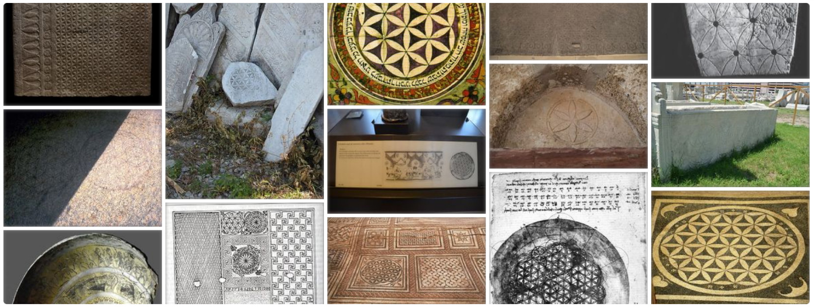

# At the dawn of the Common Era

One interesting point is that the FOL symbol was extensively used by Jews, Greeks and Romans around the dawn of the new era, 100 BC - 200 AD. Especially mosaic floors (pic. [6.1.11](2000-0bc.md#fig6.1.11), [6.1.12](2000-0bc.md#fig6.1.12), [6.1.13](2000-0bc.md#fig6.1.13), [6.2.1](0-2000ad.md#fig6.2.1)) pop up from the history using the FOL theme often next to the Cownose decoration motif.

Decorations in the temples of Herod and in the religious center of Ephesus are one of the most beautiful and complete forms of the FOL.

The intriguing question about the influence and usage of the FOL symbol comes by its mathematical properties. This would warrant a separate article: were early Christians, Gnostics, middle Platonists and Neo-Pythagoreans aware of the FOL? How about writers of the Gospels and the book of Revelation, did they know the meaning of it?

Without going any deeper into the subject, it must be mentioned that Roman Imperial was spread up to Thrace in 180 AD leaving behind several floor mosaics with the FOL symbol. These mosaics can nowadays be witnessed on excavated sites in Bulgaria (pic. [6.2.6](0-2000ad.md#fig6.2.6)) and in Italy<!-- cite author="Karl" title="House of Tragic Poet as House of Glaucus - Pompeii - Mosaic floor" date="" location="" type="website" href="https://www.flickr.com/photos/70125105@N06/13980198177/" -->, but also in Spain (pic. [6.2.2](0-2000ad.md#fig6.2.2), [6.2.3](0-2000ad.md#fig6.2.3)) and in France (pic. [6.2.4](0-2000ad.md#fig6.2.4), [6.2.5](0-2000ad.md#fig6.2.5)).

Experimental paintings on the wall of temple ruin<!-- cite author="Hans-Christian" title="Picture of temple ruin in Qasr al-Hair ash-Sharqi" date="" location="" type="website" href="https://www.flickr.com/photos/7283893@N05/5230474741/in/faves-48694711@N03/" --> in Syria desert are highly interesting and urges deeper research. The wall is full of symbols of the FOL in different forms. This resembles figure settings in Abydos wall, even Leonardo's drawings if you will.

{caption=1}


