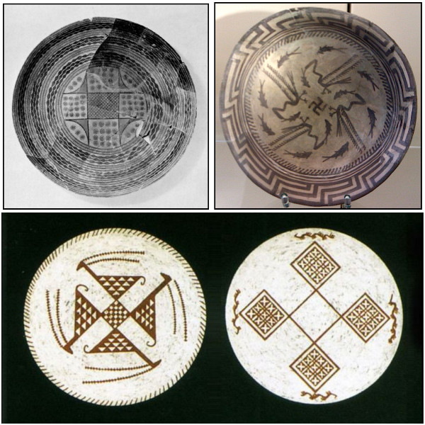

# Conclusions

I think it is too early to do any firm conclusions of the Flower of Life symbol. Dating of the symbol is hard as it is usual when trying to trace ancient inventions. Often we can talk only in accuracy of thousands years, rather than hundreds, even we speak of relatively new history. But it is clear that history of the FOL goes further than many expects. It makes sense that six petal rosette came first before the FOL preceding rhombus, triangle, hexagon and zig-zag patterns. Oblique slopes resembling 60 degrees angle goes to the neolithic periods and beyond.

How long it took to develop from six petalled rosettes to the continuous FOL pattern? That is one of many open questions. We do need classifications to distinguish the development of the symbol from simple parts to the complex form, if we want to answer these questions. Different types of the FOL symbol/pattern are visible on pictures presented in this essay but time is not used to specify them distinctively. This task belongs to the future work.

Other question is the development of the drafting compass, the divider and the caliper. These tools provided required accuracy to construct the FOL pattern. Quite often it is believed that Egyptians didn't possess the compass, that they were mere rope stretchers<!-- cite author="L.R. Shelby" title="Medieval Masons' Tools" date="1961" location="page 237" type="book" href="#" -->. In contrast to this we can see oldest objects in the current survey coming from Egypt indeed! Anyone can make own conclusions if those Egyptian cosmetic box lid carvings were made with a help of a rope/string or more accurate fixed or adjustable compass with sharp and durable endpoints. Museum object descriptions are pro to a compass. However following this line to get more information about the FOL is kind of a dead end because the history of the compass based on artifacts can be traced to the around 600 BC only. This is the earliest caliper which is found from Giglio shipwreck off the coast of Tuscany according to Roger Ulrich<!-- cite author="Roger B. Ulrich" title="Roman Woodworking" date="1961" location="pages 52-53" type="book" href="#" -->.

Are we thus forced to follow a more intuitive path and face the old Greek myth of Perdix<!-- cite author="wikipedia.org" title="Perdix mythology" date="" location="" type="website" href="http://en.wikipedia.org/wiki/Perdix_%28mythology%29" -->, who was assumed to invent a pair of compasses and a saw? Legend tells (see Ovid's dactylic hexameter poem *Metamorphoses 8*<!-- cite author="Ovid" title="Metamorphoses 8" date="1 AD" location="" type="website" href="http://www.theoi.com/Text/OvidMetamorphoses8.html#2" -->) that a zig-zag figured saw was made from the spine of a fish:

> He (Perdix) took the jagged backbone of a fish, and with it as a model made a saw, with sharp teeth fashioned from a strip of iron. And he was first to make two arms of iron, smooth hinged upon the center, so that one would make a pivot while the other, turned, described a circle.

Interestingly tessellation figure (the saw) and circle drawing tool (the compass) are combined on the same story. Perdix, who was saved by getting wings, witnessed the fall of the Icarus, who lost his wings. Let's take an advice from the instructive legend and be moderate with further conclusions at this point.

As it is with dating, it is with locating. Where did sophisticated sense of geometric forms develop to such a degree that the FOL was in ability of human mind in society to be drawn? We shouldn't forget that designs of Samarra dishes<!-- cite author="Marko Manninen" title="Samarra geometry Pinterest board" date="" location="" type="website" href="https://www.pinterest.com/markomanninen/samarra-geometry/" --> are amazingly sophisticated while they go as far as 7500 years back to the history:

{caption=1}

What was the meaning of the FOL then? It is unlikely that the name and the meaning was carried out from millennium to millennium and through different cultures unchanged and same. Sometimes symbol was probably used as an interesting decoration and ornament, pleasing and exciting on the eye of an artisan, maybe without any specific profound meaning and name. Sometimes it appears clearly on a religious context. Later, when I'm struggling more with the mathematical and geometrical properties of the FOL as well as doing comparative mythological and etymological studies, I will present possible meanings and names attached to the symbol.


