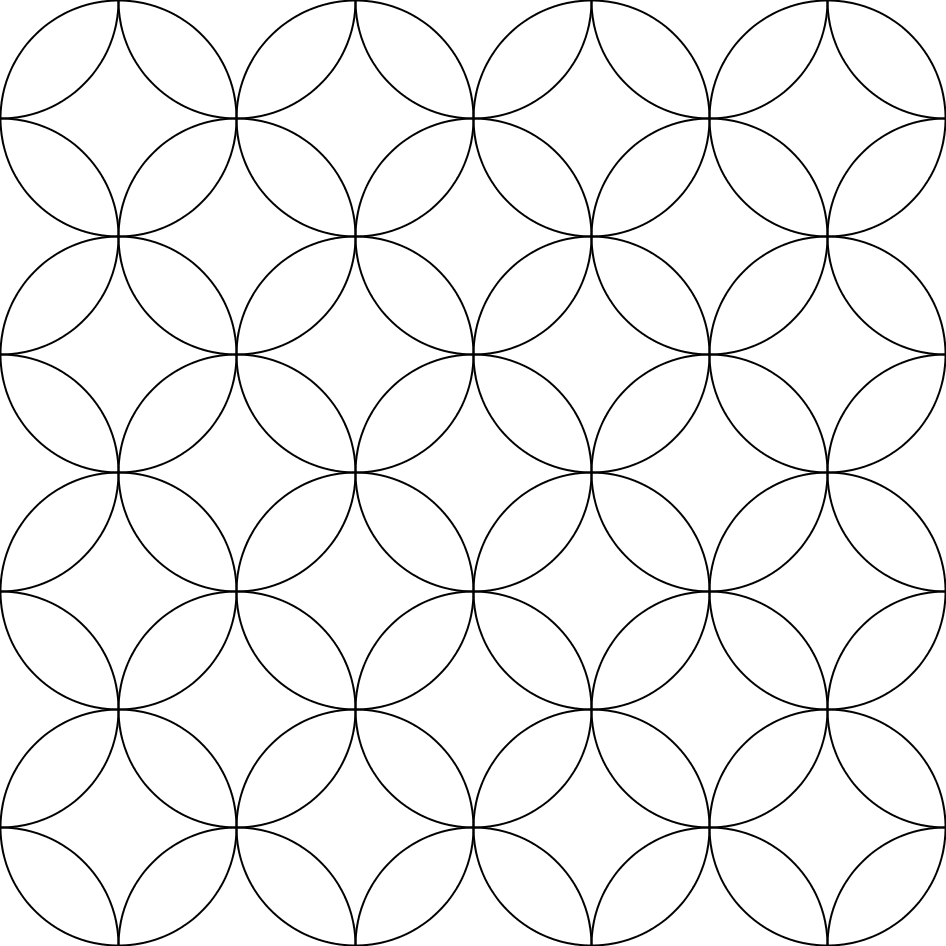
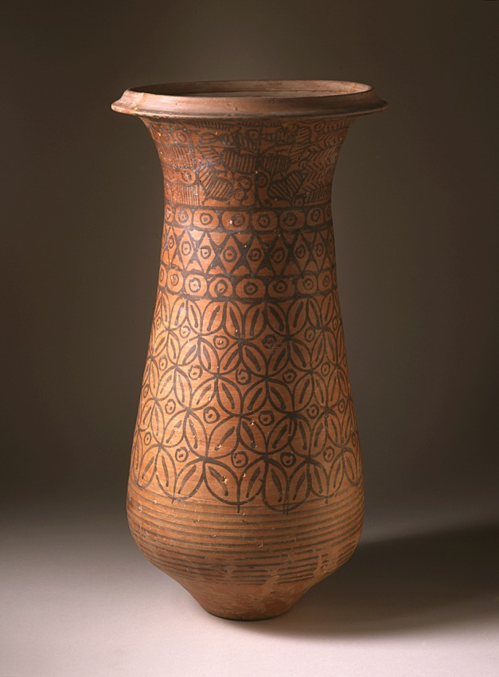
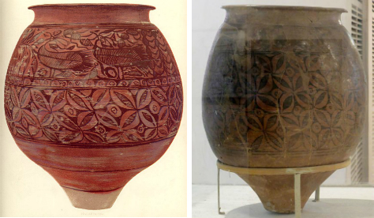

# Cownose

Educated geometrical practice relating to intersecting circles have a long tradition. We can see it from mathematical clay tablets available since Old Babylonian period (2000-1600 BC).

Intersecting circles forming the concave square or the so-called Apsamikku is discussed in *Mesopotamian mathematics*<!-- cite author="Eleanor Robson" title="Mesopotamian mathematics" date="1999" location="Chapter 2" type="book" href="https://www.academia.edu/1261766/Mesopotamian_mathematics_page_proofs_" --> by Eleanor Robson. See also: *Some old Babylonian geometry*<!-- cite author="Duncan J. Melville" title="Some Old Babylonian geometry" date="2005" location="" type="article" href="https://www.academia.edu/3604815/The_area_and_the_side_I_added_Some_Old_Babylonian_geometry" --> by Duncan J. Melville. Simple depiction of the four-petal rosette pattern in question looks like this:

{caption=1 width=300}

The Apsamikku is translated as the Cownose which refers to the exterior shape of the Stingray<!-- cite author="wikipedia.org" title="Cownose rays" date="" location="" type="website" href="https://en.wikipedia.org/wiki/Cownose_ray#/media/File:Cownose_Rays.jpg" --> fish. Naming convention in the current geometric context is a bit confusing. Cow-nose likeness of the Stingray comes from the lobes and a notched head of the Stingray. This is why the Stingray fish is also called the Cownose ray. The Apsamikku symbol doesn't look like the nose of a cow. It looks like the peripheral shape of the Cownose ray.

{caption=1 width=600}

Ceremonial vessel<!-- cite author="wikipedia.org" title="Ceremonial vessel, Harappan, 2600 - 2450 BCE" date="" location="" type="website" href="https://en.wikipedia.org/wiki/Indus_Valley_Civilization#/media/File:Ceremonial_Vessel_LACMA_AC1997.93.1.jpg" --> from Indus Valley civilization period (2600 - 2450 BC) and other objects<!-- cite author="Marko Manninen" title="Cownose Pinterest board" date="" location="" type="website" href="http://www.pinterest.com/markomanninen/cows-nose/" -->  from Harappan and Mohenjo-Daro indicates that the Cownose pattern was known in the Indus Valley already in 3000 BC.

According to Robson, in *The apsamikku in Neo-Babylonian Mathematics*<!-- cite author="Eleanor Robson" title="The apsamikku in Neo-Babylonian Mathematics" date="2007" location="page 214" type="book" href="#" --> the Cownose design was known:

> ...from Halaf pottery of the sixth millennium BC to images of Neo-Assyrian textile in Syria...

It is probable that the Cownose pattern came somewhere from the ancient Fertile Crescent. At least the earliest evidence we know comes from that area.

{caption=1 width=600}

In *Sound Holes And Geometrical Figures*<!-- cite author="Lawergren & Gurney" title="Sound Holes And Geometrical Figures" date="1987" location="Plate X" type="article" href="http://www.hunter.cuny.edu/physics/faculty/lawergren/repository/files/articles/Soundholes%20and%20Geometrical%20Figures.pdf" --> by Lawergren & Gurney, the sound hole of a lyre or a harp is called the Apsamikku. Interestingly the shape of the hole resembles more of two facing equilateral concave triangles than the concave square.

It could rather be that the Apsamikku generally refers to a hole, a window or a frame in the figure, not the exact shape of it. Then the name of the FOL symbol could have been Apsamikku + some affix. Determining the case is outside of the scope of this essay, but intriguing enough. If the FOL symbol/pattern had any particular name for ancients, I leave it for future speculations.

{caption=1 width=600}


