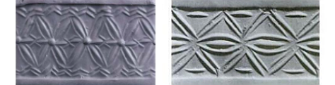

# The Flower of Life versus the Cownose

Square shape and square root of 2 is apparent on the Cownose pattern. Equilateral triangle and hexagon shape with the square root of 3 property are fundamental in the FOL. All these properties were known by Old Babylonians as it is shown in the book "*A Remarkable Collection of Babylonian Mathematical Texts*" by Joran Friberg (MS 3051 on the page 207). See also clay tablets: [IM 52916](http://math.berkeley.edu/~lpachter/128a/Babylonian_sqrt2.pdf) and [Susu]( http://www.new1.dli.ernet.in/data1/upload/insa/INSA_2/20005a5d_1.pdf).

But there are incidents in the ancient history that urges the appearance of the FOL before 2000 BC. These incidents are: sexagecimal numeral system, rhombic cone mosaics and six petal cylinders seals.

**Sexagecimal system**

Sexagecimal place value system was known in the ancient Mesopotamia in the 3rd millennium BC. Geometrical link between a circle, a hexagon and the sexagecimal system is genuinely demonstrated by [Jaime Vladimir](http://halshs.archives-ouvertes.fr/docs/00/03/44/42/DOC/geometrical_link_circle_sexagesimal_system.doc). He summarizes it:

> ...these geometrical facts show that there is a geometrical link between the circle and the sexagesimal system and that the division of the circle in 360 equal parts, which corresponds to 360 equal angles or degrees, isn't a choice that is completely independent of the geometry because this division can be suggested by the basic properties of the circles and the equilateral triangles.

The FOL and the sexagecimal system both shares same geometrial and mathematical properties. It means they would mutually benefit from the existence of each other.

{caption=1 width=474}

**Cone mosaics**

The pillar [cone mosaic](http://en.wikipedia.org/wiki/Uruk#mediaviewer/File:Pergamonmuseum_Inanna_01.jpg) from the ancient Sumerian city, Uruk (3400-3100 BC) shows a tessellation pattern. This 60 degrees zig-zag rhombus pattern formed by two equilateral triangles is inside the FOL geometry as well.

{caption=1 width=474}

**Cylinder seal**

The Sumerian brown stone [cylinder seal](http://www.christies.com/lotfinder/lot/a-sumerian-brown-stone-cylinder-seal-early-2067180-details.aspx?intObjectID=2067180) with two six petal rosettes originates from 3000 BC. Similar seals are repeatedly found from the late Uruk and Jemdet Nasr period (3100-2900 BC). See "*[Ancient Near Eastern Cylinder Seals from the Marcopoli Collection](http://www.ucpress.edu/op.php?isbn=9780520049277)*" (page 177) by Beatrice Teissier. Six petal rosette is a partial symbol inside the FOL pattern.

{caption=1}

**Trivial design**

The creation of the FOL symbol is started by drawing six intersecting circles around the seventh central circle. The FOL is easier to draw than the Cownose with a plain drafting compass (or a divider). In the FOL you continue forming the pattern from simple and direct intersection points. In the Cownose pattern you need to find perpendicular lines and right angles with more complicated procedure. This can be verified by doing both figures manually. Thus we could expect to see the FOL appearing on artifacts before the Cownose.

But surprisingly sum and substance based strictly on known artifacts is that four (and eight) pointed shapes like the Cownose were antecedent and far more prominent. Only later six pointed shapes like the FOL seems to have been used as a decoration motif.

Based on above considerations, we can safely make the next conjecture:

<!-- note -->

Prerequisite for the generation of the FOL was fulfilled in the ancient Mesopotamia already in the 3rd millennium BC. In the beginning of the 2nd millennium BC, people were playing with construction elements and pattern we find in the Flower of Life symbol.

<!-- endnote -->

Strictly speaking first occurrences of the FOL are available on artifacts from 1600 - 1500 BC. And the first FOL as a complete symbol as Melchizedek has described it, is from Marlik, 1400-1100 BC. That is, if the occurrence from Abydos is not counted because of dating debate around it.
