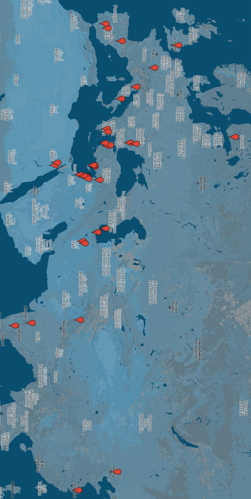

<!-- nopb -->

# Map of artifacts of the Flower of Life

The map below shows locations where cataloged artifacts were found:

	<iframe style="width:100%" height="480" frameborder="0" scrolling="no" marginheight="0" marginwidth="0" src="https://mapsengine.google.com/map/u/0/embed?mid=zbWecF_iw3HU.kwdoxVUPtuAo"></iframe>

Source: [https://goo.gl/bJFB2e](https://mapsengine.google.com/map/u/0/embed?mid=zbWecF_iw3HU.kwdoxVUPtuAo)

<!-- endnopb -->