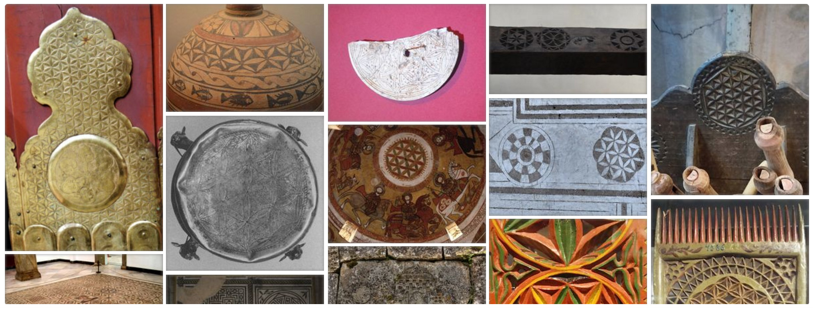

# Reflections after the research journey

I made a six week self-funded research trip to Greece, Turkey, France and Sweden in summer 2014. Since that I have been systematically collecting pictures of artifacts<!-- cite author="Marko Manninen" title="Flower of Life Pinterest board" date="" location="" type="website" href="http://pinterest.com/markomanninen/flower-of-life-history/" --> of the Flower of Life into my Pinterest account. I'm going to present inclusively chosen artifacts from Pinterest account in this essay. All artifacts have the Flower of Life symbol printed, carved or other way presented on them.

{caption=1}

Some websites already had a good collection of occurrences of the symbol at the moment of writing this (August 2014). However, my personal findings on archaeological sites and museums, followed by exhausting research on the Internet, has brought up new interesting occurrences of the Flower of Life. Artifacts of the Flower of Life in this form and scale have not been collected anywhere else before, as far as I know.

Occurrence of the Flower of Life in Egypt was first reported by the New Age author Drunvalo Melchizedek in his lectures in 80's and 90's. Later the Flower of Life was officially presented in his two volume book *The Ancient Secret of the Flower of Life*<!-- cite author="Drunvalo Melchizedek" title="The Ancient Secret of the Flower of Life" date="1999, 2000" location="" type="book" href="#" -->. Melchizedek first proclaimed the modern term **Flower of Life**. In his books Melchizedek depicts the Flower of Life by the particular geometrical figure:

{caption=1 width=300}

The Flower of Life term is often used more broadly to describe different formation phases of the symbol. I will use the Flower of Life term to denote the general pattern as well as different parts of the generation of the symbol. I will call the Flower of Life later by the abbreviation FOL.

<!-- note -->

Note: the Flower of Life symbol should not be confused with the Fleur-de-lis<!-- cite author="wikipedia.org" title="Fleur-de-lis" date="" location="" type="website" href="https://en.wikipedia.org/wiki/Fleur-de-lis" --> or the Tree of Life<!-- cite author="wikipedia.org" title="Tree of Life" date="" location="" type="website" href="https://en.wikipedia.org/wiki/Tree_of_life" --> motifs.

<!-- endnote -->

Flower of Life wiki page<!-- cite author="wikipedia.org" title="Flower of Life archived wiki page" date="" location="" type="website" href="http://web.archive.org/web/20150413033856/http://en.wikipedia.org/wiki/Flower_of_Life" --> (in August 2014) states that one of the earliest occurrences of the FOL is in the Assyrian stone carpet<!-- cite author="wikimedia.org" title="Assyrian stone carpet" date="" location="" type="website" href="https://commons.wikimedia.org/wiki/File:Floor_decoration_from_the_palace_of_King_Ashurbanipal.jpg" --> (650 BC). The wiki page also questions the dating of the FOL that is drawn on the Osirian temple stone in Abydos, Egypt. While dating of the FOL in Abydos is debated, it is evident that the geometrical formation of the symbol was known already in 1600 - 1400 BC. From that time we have artifacts which show the very same decoration motif. Artifacts are:

* Golden rosettes (pic. [6.1.1](2000-0bc.md#fig6.1.1)) from Mycenae, Greece
* Cosmetic boxes (pic. [6.1.2](2000-0bc.md#fig6.1.2)) from Thebes, Egypt
* Ivory whorls (pic. [6.1.5](2000-0bc.md#fig6.1.5)) from Cyprus
* Golden and silver goblets (pic. [6.1.3](2000-0bc.md#fig6.1.3), [6.1.5](2000-0bc.md#fig6.1.5), [6.1.14](2000-0bc.md#fig6.1.14)) from Marlik, Northern Iran

Many topics surrounding the FOL are highly controversial. This is due to Melchizedek's background in the New Age philosophy. But that shouldn't limit people from doing further research and seeking the origin of the symbol.


