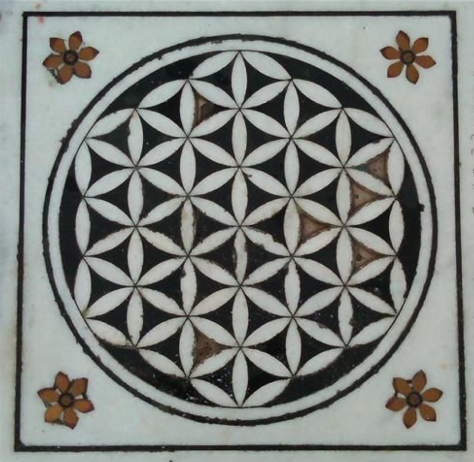

# Undated

<!-- nopb -->

#### Six petal flower lunette

A six petal flower lunette above the door of the Orthodox chapel (upper picture). More complex pattern of intersecting circles can be seen on both sides of the center circle when picture is zoomed in (lower picture). Patmos, Chora, Greece. Undated. (Photos © Marko Manninen / Creative Commons)

<!-- endnopb -->
<!-- nopb -->

#### Jewish painting

A Jewish painting that has a Hebrew inscription around the circle of the Flower of Life. Undated.

<!-- endnopb -->
<!-- nopb -->

#### Assyrian wall decoration

Presumably Assyrian [wall decoration](http://sanjindumisic.com/sumer-pergamon-museum-in-berlin/) in the Pergamon Museum in Berlin. Yet to be dated. (Photo © Sanjin Đumišić)

<!-- endnopb -->
<!-- nopb -->

#### Fu Dog Sphere

An earth sphere under the Fu dog (or male lion/Buddha). This is a common defender statue on the houses and temples in the Ming and Qing dynasties. In the picture is one of the stone lions guarding the Jing'An Temple in Shanghai, China. Undated. (Photo © Tyson Amick)

<!-- endnopb -->
<!-- nopb -->

#### Sikh temple marble floor

A Sikh temple marble floor decoration. Amritsar, India. Undated.

<!-- endnopb -->
<!-- nopb -->

#### Mosaic floor in Pompeii

[Mosaic floor](https://www.flickr.com/photos/70125105@N06/13980198177/) in the House of Tragic Poet as House of Glaucus. Italy, Pompeii. Undated.

<!-- endnopb -->
<!-- nopb -->

#### Mosaic floor in Seville

Mosaic floor in the Archeological Museum of Seville, Spain. Undated. (Photo © Rafael del Pino)

<!-- endnopb -->
