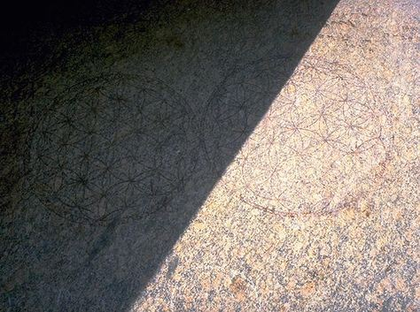
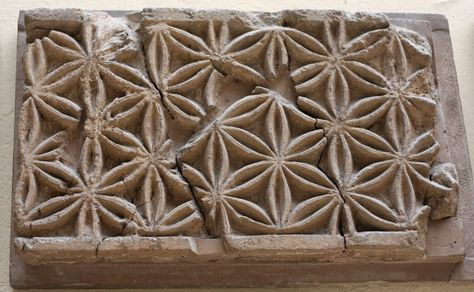
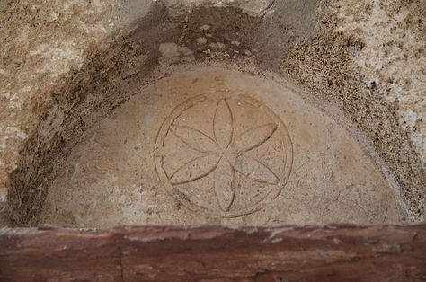
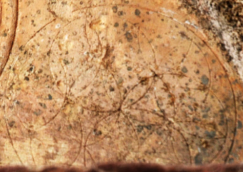
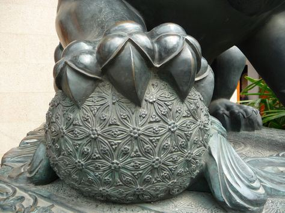
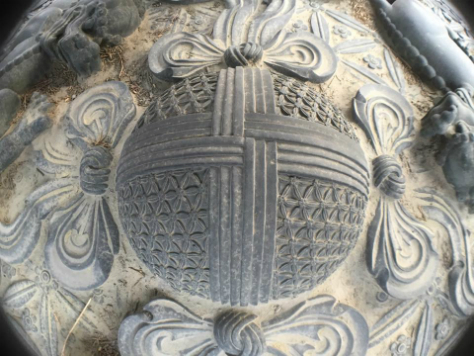
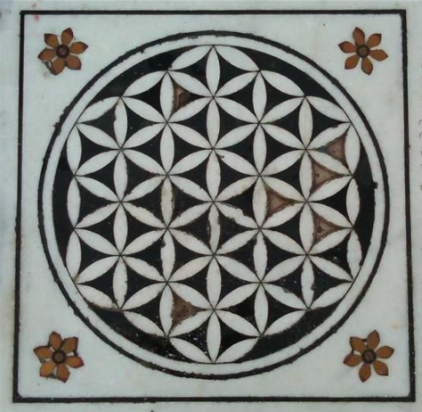
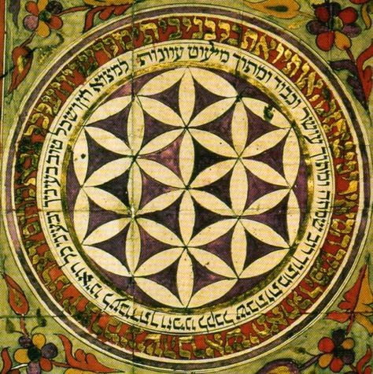

# Undated

<!-- nopb -->

#### Ornament at the Temple of Osiris

{caption=1 width=600}

The famous ornament found at the stone slab in the Temple of Osiris. Claimed to have origins from 3000 BC (or even much older), but critical analysis gives dates from 400 - 200 BC to even after 1900 AD. Abydos, Egypt. (Photo © Ray Flowers)

<!-- endnopb -->
<!-- nopb -->

#### Assyrian wall decoration

{caption=1 width=600}

Presumably Assyrian wall decoration<!-- cite author="Sanjin Đumišić" title="Sumer - Pergamon Museum in Berlin" date="" location="" type="website" href="http://sanjindumisic.com/sumer-pergamon-museum-in-berlin/" --> in the Pergamon Museum in Berlin. Yet to be dated. (Photo © Sanjin Đumišić)

<!-- endnopb -->
<!-- nopb -->

#### Six-petal flower lunette

{caption=1}

{caption=1}

A six-petal flower lunette above the door of the Orthodox chapel (upper picture). The more complex pattern of intersecting circles can be seen on both sides of the center circle when the picture is zoomed in (lower picture). Patmos, Chora, Greece. Undated. (Photos © Marko Manninen)

<!-- endnopb -->
<!-- nopb -->

#### Fu Dog Sphere

{caption=1 width=600}

An earth sphere under the Fu Dog (or male lion/Buddha). This is a common defender statue on the houses and temples in the Ming and Qing dynasties. In the picture is one of the stone lions guarding the Jing'An Temple in Shanghai, China. Undated. (Photo © Tyson Amick)

<!-- endnopb -->
<!-- nopb -->

#### Giant urn

{caption=1 width=600}

A giant urn<!-- cite author="Jamie Janover" title="Giant urn" date="" location="" type="website" href="https://www.facebook.com/JamieJanover.artist.profile/photos/a.10151941325323907.1073741826.57889468906/10152818741383907/?type=1&theater" --> in the royal gardens of the Forbidden City in Beijing, China. Undated. (Photo © Jamie Janover)

<!-- endnopb -->
<!-- nopb -->

#### Sikh temple marble floor

{caption=1 width=600}

Marble floor decoration in the Harmandir Sahib Sikh temple<!-- cite author="wikipedia.org" title="Harmandir Sahib" date="" location="" type="website" href="https://en.wikipedia.org/wiki/Harmandir_Sahib" -->. Amritsar, India. Undated.

<!-- endnopb -->
<!-- nopb -->

#### Jewish painting

{caption=1 width=600}

A Jewish painting that has a Hebrew inscription around the circle of the Flower of Life. Unplaced, Undated.

<!-- endnopb -->


